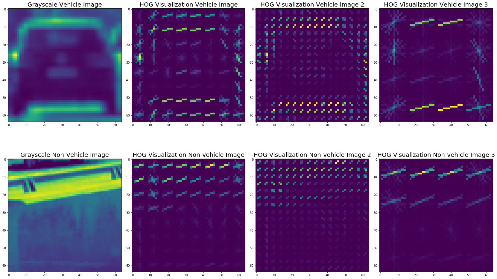

**Vehicle Detection Project**

The goals / steps of this project are the following:

* Perform a Histogram of Oriented Gradients (HOG) feature extraction on a labeled training set of images and train a classifier Linear SVM classifier
* Optionally, you can also apply a color transform and append binned color features, as well as histograms of color, to your HOG feature vector. 
* Note: for those first two steps don't forget to normalize your features and randomize a selection for training and testing.
* Implement a sliding-window technique and use your trained classifier to search for vehicles in images.
* Run your pipeline on a video stream (start with the test_video.mp4 and later implement on full project_video.mp4) and create a heat map of recurring detections frame by frame to reject outliers and follow detected vehicles.
* Estimate a bounding box for vehicles detected.

### Histogram of Oriented Gradients (HOG)

#### 1. Explain how (and identify where in your code) you extracted HOG features from the training images.

The code for this step is contained in lines 131 through 143 of the file called [`helper_functions.py`](https://github.com/ikcGitHub/CarND-Vehicle-Detection/blob/master/helper_functions.py).  

I started by reading in all the `vehicle` and `non-vehicle` images.  Here is an example of one of each of the `vehicle` and `non-vehicle` classes:

Then I randomly picked an image from each classes and experienced with them.
I explored HOG feature extraction on the same image with different `skimage.hog()` parameters (`orientations`, `pixels_per_cell`, and `cells_per_block`).

| Parameters name  | First set | Second set | Third set |
| ------------- | ------------- | ------------- | ------------- |
| Orientation  | 9  | 9 | 9 |
| Pixels per cell  | 8  | 4 | 16 |
| Cells per block  | 2  | 2 | 2 |
| Visualize  | True  | True | True |
| Feature vector  | False  | False | False |

Here is an image showing the comparison in HOG feature extraction.

Then I tried spatial binning and color histogram in different color spaces

| Parameters name  | First set | Second set | Third set | Fourth set |
| ------------- | ------------- | ------------- | ------------- | ------------- |
| Color spaces  | 'RGb'  | 'RGB' | 'HLS' | 'YCrCb' |
| Spatial size  | (32, 32)  | (32, 32) | (32, 32) | (32, 32) |
| Histogram bins  | 32  | 32 | 32 | 32 |
| Histogram range  | (0, 256)  | (0, 256) | (0, 256) | (0, 256) |

Here is an image showing the comparison in color spaces feature extraction.

#### 2. Explain how you settled on your final choice of HOG parameters.

I tried various combinations of parameters and came up th following decision with explanation.
The documentation for `hog()` function can be found [here](http://scikit-image.org/docs/dev/api/skimage.feature.html?highlight=feature%20hog#skimage.feature.hog).

* For orientations, either 9 or 17 would be acceptable. I go with `orientation = 9`.
* For pixels_per_cell, smaller number will return more cells. For a 64 by 64 pixels picture, `pix per cell = 8` is good enough.
* For cells per block, either 2 or 4 would be good. I go with `cell_per_block = 2`.
* For visualize, I don't need the image return back in the following cells. Set `False` to it.
* For feature_vector, I need it to be a 1 demensional array for concatenating to other features. Therefore, set `True` to it.
* For multichannel, I am using `HLS` color space with `ALL` channels
___
__Final list__  
orient_final = 9  
pix_per_cell_final = 8  
cell_per_block_final = 2  
vis_final = False  
feature_vec_final = True  
multichannel_final = 'ALL'  

#### 3. Describe how (and identify where in your code) you trained a classifier using your selected HOG features (and color features if you used them).

I trained a linear SVM using the following features:
+ __Color features(spatial binning, color histogram)__  
color_space_final = 'YCrCb'  
spatial_size_final = (32, 32)  
hist_bins_final = 32  
hist_range_final = (0, 256)  
  
  
+ __HOG features__  
orient_final = 9  
pix_per_cell_final = 8  
cell_per_block_final = 2  
vis_final = False  
feature_vec_final = True  
multichannel_final = 1  
___
Here are the training steps:
+ Extract the specific features from the dataset
+ Normalie the extracted features vector
+ Define labels vector
+ Split up and randomize on both extracted features vector and labels vector
    - Return training dataset and test dataset
+ Create SVM
+ Fit the training dataset into SVM
+ Evaluate the accuracy of SVM
+ Predict the result with the test dataset
+ Done

### Sliding Window Search

#### 1. Describe how (and identify where in your code) you implemented a sliding window search.  How did you decide what scales to search and how much to overlap windows?

I decided to search window at different scale at `(64, 64)` `(96, 96)` and overlap at `(0.5, 0.5)` based on the experiment below. The code below is used to evaluate the performance of different combination of window scale and overlap value.  
From the final result, I come up the following conclusions:
* Larger overlap will result in more match windows
* Less overlap will result in less match window, nevertheless, not good for the following steps "add heat" and "filter".
* Smaller window will give you more match windows to analyze
* Bigger window will result less overlap, not good for the following steps "add heat" and "filter".

I explored sliding window search on the same image with different parameteres.

| Parameters name  | First set | Second set | Third set | Fourth set | Fifth set |
| ------------- | ------------- | ------------- | ------------- | ------------- | ------------- |
| Window size  | (64, 64)  | (64, 64) | (64, 64) | (32, 32) | (96, 96) |
| Window overlap  | (0.5, 0.5)  | (0.2, 0.2) | (0.8, 0.8) | (0.5, 0.5) | (0.5, 0.5) |

Here is an image showing the comparison in different window size and overlap.

#### 2. Show some examples of test images to demonstrate how your pipeline is working.  What did you do to optimize the performance of your classifier?

Ultimately I searched on multiple scales using HLS 3-channel HOG features plus spatially binned color and histograms of color in the feature vector, which provided a nice result. Those features extraction, classifying and window drawing were implemented in the function `find_cars()`. To enhance the efficiency of classifying, there are few code in `find_cars()` to extract HOG features just once for the entire region of interest in each full image / video frame. Please refer to the below images for your reference.

Updates on 02/09:
1. Use color space `YCrCb`
2. Use scale instead of window size in `find_car()`
3. Control the window by setting `y_start` and `y_stop`
4. Apply `if svc.decision_function(X) > threshold:`
5. Fixed scale problem while using `matplotlib.image` on importing jpg or png format  

### Video Implementation

#### 1. Provide a link to your final video output.  Your pipeline should perform reasonably well on the entire project video (somewhat wobbly or unstable bounding boxes are ok as long as you are identifying the vehicles most of the time with minimal false positives.)
Here's a [link to my video result](./test_videos_output/project_video_output.mp4)

#### 2. Describe how (and identify where in your code) you implemented some kind of filter for false positives and some method for combining overlapping bounding boxes.

I recorded the multiple scales position of positive detection in each frame of the video.  From the positive detections I created a heatmap and then thresholded that map to identify vehicle positions.  I then used `scipy.ndimage.measurements.label()` to identify individual blobs in the heatmap.  I then assumed each blob corresponded to a vehicle.  I constructed bounding boxes to cover the area of each blob detected.  

Here's an example result showing the heatmap on those time-series images, the result of `scipy.ndimage.measurements.label()` and the bounding boxes then overlaid on the last frame of video:

### Here are six series frames from video and their corresponding heatmaps:
You can tell my heatmap is accumulating the heat from previous heatmap.  

### Here are the drawn image from above six series images

### Discussion

#### 1. Briefly discuss any problems / issues you faced in your implementation of this project.  Where will your pipeline likely fail?  What could you do to make it more robust?

Here are my steps to approach to the final pipeline.
+ Created my pipeline architecture with a small amout of test data
  - Extract the specific features from the dataset
  - Normalie the extracted features vector
  - Define labels vector
  - Split up and randomize on both extracted features vector and labels vector
      * Return training dataset and test dataset
  - Create SVM
  - Fit the training dataset into SVM
  - Evaluate the accuracy of SVM
  - Predict the result with the test dataset

+ Tried different combination of color spaces and HOG features.
+ Tried different heatmap threshold to filter out the false positive

Here are my problems/issues
1. Length of feature vector doesn't match the scaler
  - Fixed by controling the dimension of the feature vector
2. Too many or too less matched windows
  - Improved by using moderate window size and overlap
  - Improved by tunning the color spaces
  - Improved by tunning the HOG feature parameters
3. Drawing window in the shawdow of the tree.
  - Record the previous position and predict the next window appearance.
  - Calculate the width of window, discard the window if it is too wide.
  
Updates on 02/09:
1. Use color space `YCrCb`
2. Use scale instead of window size in `find_car()`
3. Control the window by setting `y_start` and `y_stop`
4. Apply `if svc.decision_function(X) > threshold:`
5. Fixed scale problem while using `matplotlib.image` on importing jpg or png format
